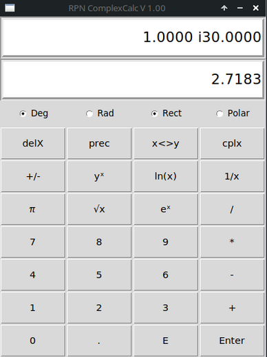
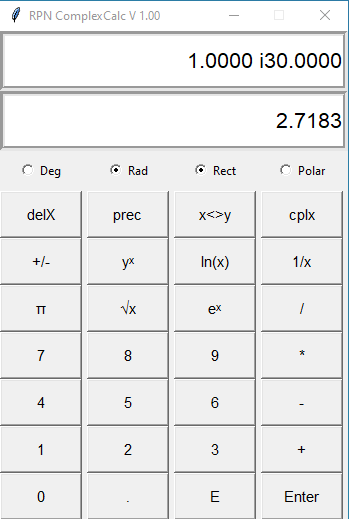

## RPN Calculator for real and complex numbers

| MX Linux                       | Windows                      |
| :----------------------------- |  :-------------------------- |
| |  |
 
Run:    **python3** rpnCompCalc.py 

[English documentation](./docs/RPN_ComplexCalc.pdf)

[Deutsche Documentation](./docs/UPN_Taschenrechner.pdf)

# Reverse Polish Notation (RPN)

First the numbers, then the operator ($+$, $*$ ...). The **X-Field** is the Input-Field. The **Enter** button
copies the value from the **X-Field** to the **Y-Field**. 

The stack of the calculator

  |Field      |   Stack  |               |
  |:-------   |:-------- |:-------------:|
  |T-Register |0.0000    |not visible    |
  |U-Register |0.0000   |not visible     |
  |Y-Field    |0.0000   | visible        |
  |X-Field    |0.0000   | visible        |

Calculate $35 + 14.7 = 49.7$:  Keystrokes --> 35 **Enter** 14.7 **+** or 14.7 **Enter** 35 **+**  

Calculate $(35 + 14.7) * 7 = 347.9$ :  Keystrokes --> 35 **Enter** 14.7 **+** 7 $*$
 
A RPN calculator do not need brackets!

Complex numbers

Complex numbers are two-dimensional numbers, with a real- and imaginary
part. Calculation is similar to binomial theorem. 

$$ (a+b)^2 = a^2 + 2ab + b^2 \qquad \text{binomial theorem} $$

$$ (a+ib)^2 = a^2 + i2ab - b^2 = a^2 - b^2 + i2ab \qquad \text{Complex number} $$

Get $-b^2$ because of $i^{2} = -1$.  

There are two ways to represent complex numbers:

  - Rectangular coordinates (a + ib) (Rect)

  - Polar coordinates $|r||e^{i\varphi}$ (Pol)

# Operating instructions

The complex number 3 + i5 in rectangular coordinates (Rect): 

Keystrokes --> 3 **Enter** 5 **cplx** 
  
The real part 3 in the Y-Field and the imaginary part 5 in the X-Field.

# Trigonometric Functions

The right triangle in a circle with the radius $r = 1$. 

$$\cos^2a + \sin^2b = 1$$

Formular of Euler:
$$e^{i \cdot \varphi ^\circ} =  \cos(\varphi ^\circ) + i \sin(\varphi ^\circ)$$

Calculation of sine, cosine and tangent of $\varphi = 30 ^\circ$ (Pol and Deg):  
  
The input (Pol and Deg):

| Input                 | X-Field              	| Y-Field   |
| :---------------------|:--------------------	|:----------|
| 1                     | 1                		| 0.0000    |
| Enter                 | 1.0000           		| 1.0000 	|
| 30                    | 30               		| 1.0000 	|
| cplx                  | 1.0000  $\angle$ 30   | 0.0000    |
| Rect                  | 0.8660  i 0.5000 		| 0.0000    |
| cplx                  | 0.5000           		| 0.8660 	|
| x<>y    	| 0.8660           		| 0.5000 	|
| /                     | 0.5774           		| 0.0000    |

The $\sin(30 ^\circ) = 0.5$, the $\cos(30 ^\circ) = 0.866$. The last
value in the table is $\tan(30 ^\circ) = 0.5774$.  

Backwards for the atan (Rect and Deg):  

| Input                 | X-Field                   | Y-Field    |
| :-------------------- | :-------------------------| :--------- |
| 1                     | 1                      	| 0.5774     |
| x<>y 	| 0.5774                 	| 1.0000 	 |
| cplx                  | 1.0000 i 0.5774           | 0.0000     |
| Pol                   | 1.1547 $\angle$ 30.0000 	| 0.0000     |

# Homers last theorem

Calculation with big numbers. The Simpsons and Fermat’s last theorem!

$$3987^{12} + 4365^{12} = 4472^{12}$$

One of the author of the of the TV-series wrote a C-Programm to find this equation.

| Input   | X-Field    | Y-Field    | U-Register |
| :------ | :--------- | :--------- | :--------- |
| 3987    | 3987       | 0.0000     |            |
| Enter   | 3987.0000  | 3987.0000  |            |
| 12      | 12         | 3987.0000  |            |
| $y^x$   | 1.6134e+43 | 0.0000     |            |
| 4365    | 4365       | 1.6134e+43 |            |
| Enter   | 4365.0000  | 4365.0000  | 1.6134e+43 |
| 12      | 12         | 4365.0000  | 1.6134e+43 |
| $y^x$	  | 4.7842e+43 | 1.6134e+43 |            |
| \+      | 6.3977e+43 | 0.0000     |            |
| 4472    | 4472       | 6.3977e+43 |            |
| Enter   | 4472.0000  | 4472.0000  | 6.3977e+43 |
| 12      | 12         | 4472.0000  | 6.3977e+43 |
| $y^x$   | 6.3977e+43 | 6.3977e+43 |            |

The left and the right side of the equation are equal\!. But the
toggle-button **prec** shows, that Fermat’s last theorem was not disproved.

# Keyboard

| Key       | Function    		|
| :--------	| :------------- 	| 
| .			|Comma 				|
| e			|Exponent			|
| Return	|Enter				|
| c			|Makes a complex number vice versa|
| p 		|Rectangular to Polar|
| r 		|Polar to Rectangular| 
| g 		|Radian to Degree  	(Degree: German --> Grad)|
| b 		|Degree to Radian  	(Radian: German --> Bogenmaß)|
| a 		|ShowPreciseDisplay	(accurate)|
| s 		|+/- (sign)|
| +			|Addition|
| -			|Subtraction|
| m 		|Multipication
| d 		|Division
| i 		|1/x (inversion)|
| x 		|$e^x$ (x sounds like ex)|
| w 		|Square root (German --> Wurzel ziehen)|
| t 		|$y^x$ (to the power)|
| l 		|ln(x)|
| k 		|pi (German --> Kreiszahl)|
| o 		|delX (rub out)|
| v 		|x<>y (vice versa)|

